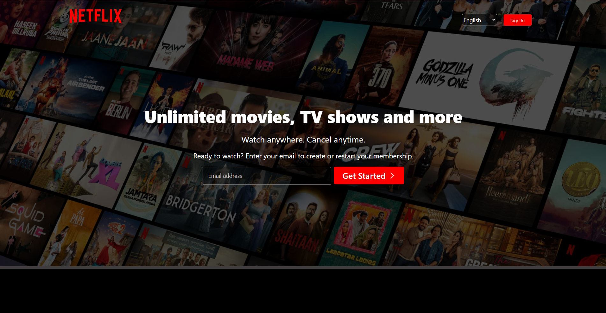

# Netflix Clone

A responsive Netflix landing page clone built with HTML and CSS.

## Features

- Modern Netflix-inspired UI
- Responsive design for desktop and mobile
- Custom navigation bar with language selector and sign-in button
- Hero section with background image and call-to-action
- Multiple feature sections with images and videos
- FAQ section styled as accordions
- Footer with useful links and contact information

## Project Structure

```
.
├── Assets/
│   ├── arrow.png
│   ├── background.jpg
│   ├── boxshot.png
│   ├── language.png
│   ├── logo.svg
│   ├── mobile.jpg
│   ├── picture.png
│   ├── plus.svg
│   ├── tv.png
│   ├── tv2.png
│   ├── video1.mp4
│   └── video2.mp4
├── Index.html
├── style.css
└── .gitattributes
```

## Getting Started

1. Clone or download this repository.
2. Open `Index.html` in your web browser to view the project.

## Screenshots



## License

This project is for educational purposes only and is not